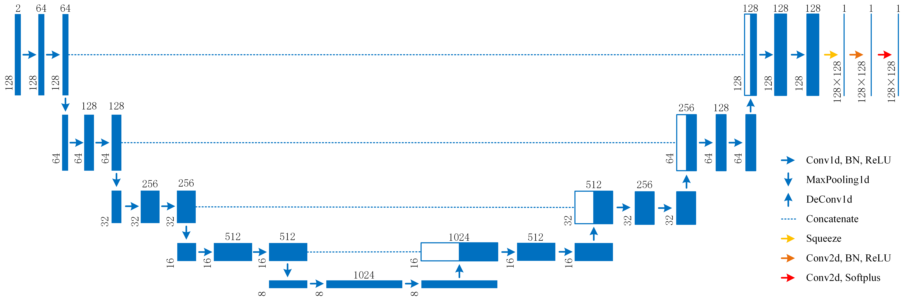

# UNet

## 架构图

## 参考

1. https://github.com/milesial/Pytorch-UNet

   基于该github项目，针对本问题进行修改

2. Deep Learning-Based 3D Gravity Inversion: A Comparative Analysis of CNN Architectures for Density Estimation

   参考该工作，在最后的输出层使用softplus激活函数